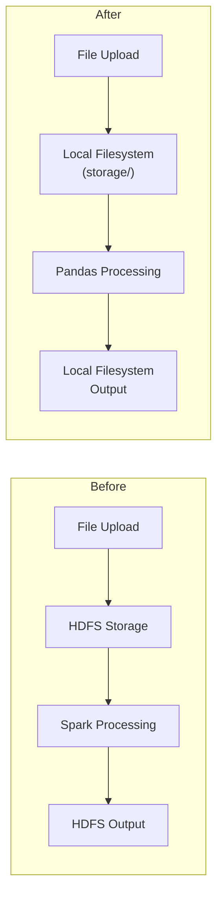

# Remove Hadoop/Spark Dependencies and Replace with Local/Pandas

## Architecture Change

## 1. Delete Files

- **[backend/app/utility/hdfs_services.py](backend/app/utility/hdfs_services.py)** - HDFS service manager (288 lines)
- **[backend/app/utility/spark_services.py](backend/app/utility/spark_services.py)** - Spark session manager (597 lines)
- **[backend/app/api/testjob.py](backend/app/api/testjob.py)** - PySpark test script (not registered in main.py, standalone test)

## 2. Create Replacement Services

### [backend/app/utility/local_storage_services.py](backend/app/utility/local_storage_services.py) (NEW)

Replace `HDFSServiceManager` with `LocalStorageManager`. All files live in a **single flat directory** read from `LOCAL_STORAGE_DIR` env var (default: `./storage`). No subdirectories -- raw uploads, converted parquets, and preprocessed outputs all coexist in one folder (filenames are already unique due to UUID suffixes on processed files).

Methods:

- `delete_file(filename)` - uses `shutil.rmtree()` (for parquet dirs) / `os.remove()` (for single files)
- `list_files()` - uses `os.listdir()` + `os.path.getsize()` / `os.walk()` for recursive size, returns formatted list
- `rename_file_or_folder(old_name, new_name)` - uses `shutil.move()` within the base dir
- `copy_to_local(source_name, dest_path)` - copies from storage dir to an arbitrary local path (replaces HDFS download for federated)
- `save_file(source_path, filename)` - copies/moves an external file into the storage dir
- `get_path(filename)` - returns the full path to a file in the storage dir

### [backend/app/utility/data_processing_services.py](backend/app/utility/data_processing_services.py) (NEW)

Replace `SparkSessionManager` with `DataProcessingManager`. Uses `LocalStorageManager.get_path()` to resolve file locations in the single storage directory.

- `create_new_dataset(filename, filetype)` - reads CSV/Parquet via pandas from storage dir, writes as Parquet to storage dir, generates overview
- `preprocess_data(filename, operations)` - reads Parquet from storage dir, applies operations via pandas `processing_helper_functions`, writes result to storage dir with UUID suffix. No `directory` param needed (single dir).
- `create_qpd_dataset(filename, num_points)` - `df.sample(n=num_points)`, writes to S3 (keep S3 logic, just use pandas)
- `_get_overview(df, filename)` - compute stats with pandas: `df.describe()`, `df.head()`, quantiles, histograms via `np.histogram`
- Move `serialize_for_json()` here (used by test_serialization.py)
- `delete_file(filename)` - delegates to `LocalStorageManager.delete_file()` (replaces old SparkSessionManager.delete_file_from_hdfs)

## 3. Rewrite Processing Helper Functions

### [backend/app/utility/processing_helper_functions.py](backend/app/utility/processing_helper_functions.py)

Complete rewrite from PySpark to pandas. Key mappings:

- `Imputer` -> `df[cols].fillna(df[cols].mean())`
- `VectorAssembler` + `MinMaxScaler` -> `sklearn.preprocessing.MinMaxScaler`
- `StandardScaler` -> `sklearn.preprocessing.StandardScaler`
- `Normalizer` -> `sklearn.preprocessing.normalize()`
- `StringIndexer` -> `sklearn.preprocessing.LabelEncoder`
- `OneHotEncoder` -> `pd.get_dummies()` or `sklearn.preprocessing.OneHotEncoder`
- `remove_outlier_by_IQR` -> pandas quantile + boolean indexing
- `normalize_column` -> pandas `min/max/mean/std` calculations
- `F.log/sqrt/pow` -> `np.log/np.sqrt/np.square`

Preserve function signatures: `All_Column_Operations(df, step, numericCols, allCols)` and `Column_Operations(df, step)` -- but `df` is now a pandas DataFrame.

## 4. Update Backend API Files

### [backend/app/api/preprocessing_routes.py](backend/app/api/preprocessing_routes.py)

- Replace imports: `from utility.local_storage_services import LocalStorageManager` and `from utility.data_processing_services import DataProcessingManager`
- Remove all HDFS env vars (`HDFS_RAW_DATASETS_DIR`, `HDFS_PROCESSED_DATASETS_DIR`, `HDFS_NEW_TARGET_PATH`, `HDFS_TARGET_PATH`, `RECENTLY_UPLOADED_DATASETS_DIR`)
- `create_new_dataset` endpoint: save uploaded file to storage dir via `LocalStorageManager.save_file()`, then process with pandas
- `process_preprocessing`: rename via `LocalStorageManager`, process via pandas (no `directory` param to `preprocess_data` -- single dir), write result to storage dir
- The `directory` parameter from the frontend is repurposed as `dataset_type` ("raw"/"processed") and passed to `handle_file_renaming_during_processing` for DB table routing
- All `hdfs_client.`* calls -> equivalent `LocalStorageManager` calls
- Remove all commented-out old code at the bottom (lines 496-642)

### [backend/app/api/file_upload_routes.py](backend/app/api/file_upload_routes.py)

- Replace `HDFSServiceManager` with `LocalStorageManager`
- `upload_file_to_hdfs` -> `upload_file`: save temp file to storage dir via `LocalStorageManager.save_file()`
- `list_uploaded_files`: `LocalStorageManager.list_files()`
- `delete_uploaded_file`: `LocalStorageManager.delete_file(filename)`
- Remove `HDFS_URL`, `HDFS_TARGET_PATH` env vars
- Update response messages (remove "HDFS" text)

### [backend/app/api/confidential_routers.py](backend/app/api/confidential_routers.py)

- Remove `from pyspark.sql import SparkSession` import
- Remove all HDFS/Spark env vars (`HADOOP_USER_NAME`, `HDFS_NAME_NODE_URL`, `SPARK_MASTER_URL`, etc.)
- Remove `/start-spark-job` endpoint (runs `spark-submit`)
- Remove `/read-hdfs-file-from-spark` endpoint (reads CSV via Spark from HDFS)
- Keep `/create-dataset` and `/create-raw-dataset` endpoints (they only use SQLAlchemy)

### [backend/app/api/qpd_routers.py](backend/app/api/qpd_routers.py)

- Replace `from utility.spark_services import SparkSessionManager` with `from utility.data_processing_services import DataProcessingManager`
- Replace `spark_client = SparkSessionManager()` with `data_client = DataProcessingManager()`
- The actual `create_qpd_dataset` call is inside a TODO block (line 26 returns a placeholder before reaching it), so update the reference for when it's eventually enabled

### [backend/app/api/model_training_routes.py](backend/app/api/model_training_routes.py)

- Line 33 comment: change "Fetch client_data from hdfs" to "Fetch client_data" 
- No import changes needed (uses `federated_services.process_parquet_and_save_xy` which we'll update separately)

### [backend/app/utility/federated_services.py](backend/app/utility/federated_services.py)

- Replace `from utility.hdfs_services import HDFSServiceManager` with `from utility.local_storage_services import LocalStorageManager`
- Remove `HDFS_PROCESSED_DATASETS_DIR` env var
- In `process_parquet_and_save_xy`: use `LocalStorageManager.copy_to_local(filename, temp_download_dir)` instead of HDFS download -- the parquet files are already in the single storage dir

### [backend/app/crud/datasets_crud.py](backend/app/crud/datasets_crud.py)

- Remove `HDFS_RAW_DATASETS_DIR`, `HDFS_PROCESSED_DATASETS_DIR` env vars
- Change `handle_file_renaming_during_processing` to accept a `dataset_type` string ("raw" or "processed") instead of comparing against directory env vars

### [backend/app/utility/extras/test_serialization.py](backend/app/utility/extras/test_serialization.py)

- Update import: `from utility.data_processing_services import serialize_for_json`

## 5. Remove Python Packages

### [backend/app/requirements.txt](backend/app/requirements.txt)

Remove:

- `findspark==2.0.1`
- `hdfs==2.7.3`
- `pyspark==4.0.0`
- `py4j==0.10.9.9`

Keep:

- `pyarrow==20.0.0` (needed by pandas for parquet I/O)
- `scikit-learn==1.7.0` (already present, needed for new preprocessing)

## 6. Docker/Compose

### [backend/Dockerfile](backend/Dockerfile)

- Remove lines 14-21 (JAVA_HOME, SPARK_HOME comments)

### [docker-compose.yaml](docker-compose.yaml)

- No Hadoop/Spark containers to remove (they were external)
- No changes needed

## 7. Environment Files

### [.env.example](.env.example)

- Remove: `HADOOP_USER_NAME`, `HDFS_URL`, `HDFS_RAW_DATASETS_DIR`, `HDFS_PROCESSED_DATASETS_DIR`, `RECENTLY_UPLOADED_DATASETS_DIR`, `HDFS_NAME_NODE_URL`, `SPARK_MASTER_URL`, `REACT_APP_HDFS_RAW_DATASETS_DIR`
- Add: `LOCAL_STORAGE_DIR=./storage`

### [frontend/app/.env.example](frontend/app/.env.example)

- Same removals as above
- Add: `LOCAL_STORAGE_DIR=./storage`

## 8. Frontend Changes

### [frontend/app/src/components/DataPipeline/DataSetVisuals/RawDataSetOverview.jsx](frontend/app/src/components/DataPipeline/DataSetVisuals/RawDataSetOverview.jsx)

- Line 116: Change `directory={process.env.REACT_APP_HDFS_RAW_DATASETS_DIR}` to `directory="raw"` (now used as dataset_type identifier, not a path)

### [frontend/app/src/components/DataPipeline/DataSetVisuals/ProcessedDataSetOverview.jsx](frontend/app/src/components/DataPipeline/DataSetVisuals/ProcessedDataSetOverview.jsx)

- Already sends `directory="processed"` which works as a dataset_type -- no change needed

### [frontend/app/src/components/DataPipeline/ViewAllDatasetsHelper/AddDataset.jsx](frontend/app/src/components/DataPipeline/ViewAllDatasetsHelper/AddDataset.jsx)

- Line 31: Update comment "from HDFS" -> "from server"
- Line 281: Button text "Upload to HDFS" -> "Upload"

### [frontend/app/src/components/OnRequestPage/RequestComponents/SelectDatasetsStep.jsx](frontend/app/src/components/OnRequestPage/RequestComponents/SelectDatasetsStep.jsx)

- Line 211: Update comment "from HDFS" -> "from server"

### [frontend/app/src/components/DataPipeline/ViewAllDatasets.jsx](frontend/app/src/components/DataPipeline/ViewAllDatasets.jsx)

- Line 139: Update comment "from HDFS" -> "from server"

## 9. Shell Scripts

- [install_local.sh](install_local.sh) and [start_local.sh](start_local.sh) - no HDFS/Spark references found, no changes needed

## Scope Exclusions

- Redis, federated learning, S3 (QPD), SQLAlchemy, TensorFlow - all untouched
- `training_script.py`, `model_builder.py` - no HDFS/Spark usage, no changes

